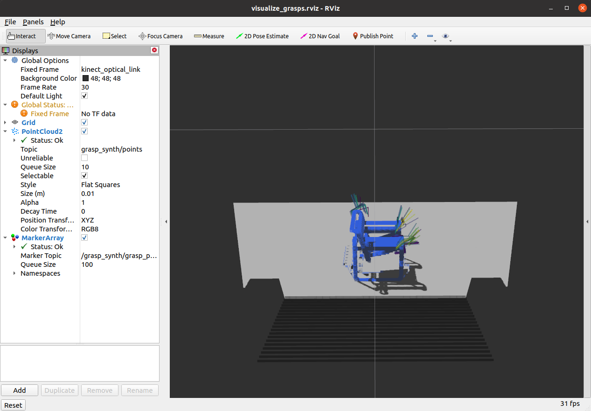

# grasp_synth
A ROS package containing a node, `find_grasps_server.py`, exposing a grasp synthesis service. 
The service has the following inputs and outputs:

> **Inputs:**
>
> * How many grasps to generate (`top_k`).
>
> **Outputs:**
> * A Grasps message containing `top_k` different Grasp messages and their corresponding confidences.
>   * Each Grasp message contains the gripper pose, approach direction, baseline direction, and width.
>   * Each confidence is a floating-point value from 0 to 1.

Upon receipt of this message, the find_grasp_server node will use the latest PointCloud2 from '/camera/depth/points' and find `top_k` grasp poses. The PointCloud2 message's header is copied into the `grasps` item that is returned.

## Installation
Installing the neural network is quite involved because it requires many dependencies and some Python 
path-hacking.

In a nutshell, installing the network involves setting up an Anaconda virtual environment to contain
the Python dependencies, and compiling the message and service definitions using `catkin build`. 
Documenting the installation process is a lingering TODO, so if it looks necessary to install the network 
please email `playert@oregonstate.edu`.

## Usage

### 1. Launching the grasp service:
To start the grasp service node alone, simply run
```
rosrun grasp_synth find_grasp_server.py
```
after sourcing your workspace's `devel/setup.bash` and starting the `roscore`.

### 2. Launching the demo:
To demonstrate the grasp synthesis functionality, there is a demo that launches several processes:
* the grasp synthesis service node, called `find_grasp_server.py`.
* a node called `depth_cam_emulator.py` to read point clouds from a rosbag and publish them to the topic `camera/depth/points`.
* a client node called `find_grasp_client.py` to request grasps over the ROS service
* the `rviz` GUI for visualization.
* a node called `grasp_pose_to_marker_array.py` publishing a MarkerArray for rviz visualization.

The command is shown below.

```
roslaunch grasp_synth grasp_server_demo.launch bag_name:=mug.bag top_k:=40
```
Any of the object point clouds from the `bags/` directory can be used, and any number of
grasps from 1 to 90,000 is valid (though high numbers of grasps may display slowly.) The output is shown below.



### 3. Networked demo using ROS nodes:
First, clone and build this package into a ROS workspace on the separate client computer.

Then plug the two computers in via ethernet cable and follow the instructions from [this webpage](https://github.com/brennanyama/RobotOperatingSystem/wiki/ROS-network-setup-between-two-devices-via-ethernet-cable)
to manually set your IP address on either side of cable. Set `ROS_MASTER_URI` and `ROS_HOSTNAME`
appropriately on **each** computer. The computers should have the same `ROS_MASTER_URI` but
different `ROS_HOSTNAME`s. 

Then, run the demo by issuing, on the grasp synthesis server computer,
```
roslaunch grasp_synth grasp_server.launch
```

and on the separate client computer,
```
roslaunch grasp_synth grasp_client.launch
```

If the computers are properly networked (which is tough), then the same `rviz` output as before
should appear on the client computer's screen.

### 4. Networking using `rosbridge`:
The `grasp_server.launch` launchfile starts a `rosbridge` server node, which should expose the FindGrasps service on port
`localhost:9090`. However, I am not sure how to encode a `sensor_msgs/PointCloud2` into JSON, so I have not demoed that
functionality.

## Code Explanation

The ROS service and client functions are straightforward extensions of the examples
from the ROS docs, and the folder layout follows the usual format for ROS packages.
There is some deep hackery going on in the `nn/` folder that I'm happy to explain.
The `find_grasp_server.py` node, which identifies grasps, does some filtering and
downsampling before feeding the input point cloud into the neural network.

Here is a high-level description of each relevant folder/file. 

```
grasp_synth/
    | bags/                                 rosbags containing point cloud examples
    | config/                               demo configuration, including RViz config
    | figs/                                 figures for use in README
    | launch/                               ROS launch files for server, client, and integrated demo
    | msg/                                  ROS message definitions for Grasp and Grasps
    | nn/                                   neural network dependencies
    | nodes/                                ROS service, client, and marker-publisher nodes
        -- find_grasp_client.py             Client node to read point clouds from bag files and request grasps.
        -- find_grasp_server.py             ROS service node that accepts point cloud messages and identifies grasps.
        -- grasp_pose_to_marker_array.py    Helper node that transforms a Grasps message into a MarkerArray for rviz.

    | srv/                                  ROS service definitions for FindGrasps
    | urdf/                                 3D shape resources (now just mesh file for gripper marker)
    -- CMakeLists.txt                       build-tool automation script
    -- package.xml                          ROS build-tool automation script
    -- README.md                            this file :)
```
